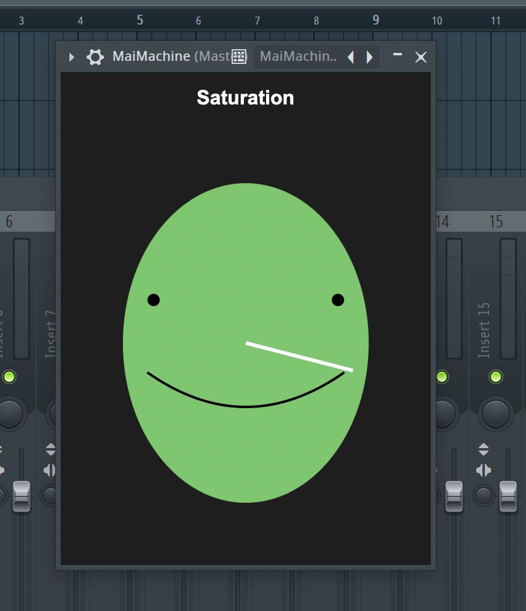
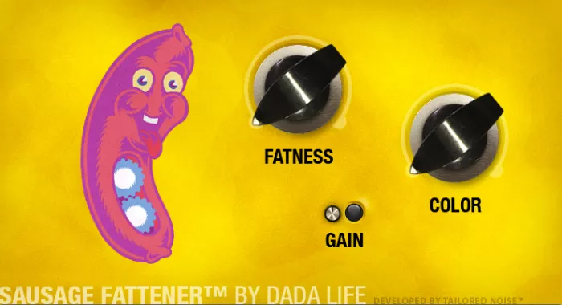

# README Saturation - Distortion VST Plugin / Post-Notebook https://youtu.be/zfdN4CwQ9P0

## Link to demo: https://youtu.be/zfdN4CwQ9P0

Apologize for not having version control.
I made a new repo today and pushed everything I had after the finishing touches.
I used JUCE on mac so that means I had to go through xcode, which I didn't even
know how to integrate git with it until now.

But to run the code I'm not sure how to do it without the projucer file, but the dependencies are those JUCE library code.

Above is the link to a demo of my plugin and i will share more thoughts below.

I said it a bit already in my portfolio notes, but my inspiration for this was to create a VST that had the same vibe as those simple to use plugins that I see many people enjoy. One plugin in particular , "Sausage Fattener" is a plugin that has like 2 knobs and just makes the sound a lot more beefier. The ui as you increase the knob becomes a happy sausage to an angry one, and I wanted to see if I could emulate that in the code.


The UI didn't seem that hard to do, just based on some conditionals for where the current knob value is at. This ended up being what I needed to do, but actually painting my UI was a lot more trial and error based.

```
void paint(juce::Graphics& g) override
{
    auto bounds = getLocalBounds().toFloat();
    
    // background color
    float value = getValue();
    if (value < 0.33f)
        g.setColour(juce::Colour(100, 200, 100));
    else if (value < 0.66f)
        g.setColour(juce::Colour(200, 200, 100));
    else
        g.setColour(juce::Colour(200, 100, 100));
        
    g.fillEllipse(bounds);

    // face
    g.setColour(juce::Colours::black);
    float centerX = bounds.getCentreX();
    float centerY = bounds.getCentreY();
    float size = bounds.getWidth() * 0.4f;

    g.fillEllipse(centerX - size, centerY - size * 0.5f, 10.0f, 10.0f);
    g.fillEllipse(centerX + size - 10.0f, centerY - size * 0.5f, 10.0f, 10.0f);
```
Here is a snippet of it, drawing with these functions reminded me a bit of turtle graphics, and I had the most troubles getting the quadratic smile I wanted. I just needed to dive into the math a bit, but was trying to put it off if possible.

But for the knob it simply goes from 0 to 1.0

```
    params.push_back(std::make_unique<juce::AudioParameterFloat>(
        "saturation",  // parameterID
        "Saturation", // parameter name
        0.0f,         // minimum value
        1.0f,         // maximum value
        0.0f));       // default value
```

Now onto the processing, juce makes it really easy for you with their boiler plate

All of my processing is done in this loop they started for me 
```
for (int i = 0; i < buffer.getNumSamples(); ++i)
```

To follow my theme, i wanted to have 3 distinct characters for my plugin.

0-0.32 will be a soft lofi saturation

0.33 - 0.65 will be more of a traditional saturation

0.66 - 1.0 will be heavily distorted - something shoegaze like my bloody valentine

With my limited abilities I wanted them to standout from one another as much as possible, so 
besides cranking the drive up for each respective character, I wanted to add some differences to each one. For example for the lofi one, i added static crackly sounds

```
if (amount < 0.33f) {
    // Light crackly distortion
    float sectionAmount = amount * 3.0f;
    float drive = sectionAmount * 2.0f + 1.0f;
    processed *= drive;

    // WITHOUT this it would play static all the time if an instance of the VST was up
    // even when audio was not playing
    if (std::abs(clean) > 0.01f) {  // Threshold for when to add crackle
        
        float random = static_cast<float>(rand()) / RAND_MAX;
        float crackleThreshold = 0.95f;
        
        float noise = 0.0f;
        if (random > crackleThreshold) {
            noise = (static_cast<float>(rand()) / RAND_MAX * 4.0f - 1.0f);
            noise *= noise * noise;
        }
```

But overall to get the saturation / distortion, i used the tanh function for all of them
```
processed = std::tanh(processed * 0.6f);
```

From my previous distortion plugin i made in sophmore year, I didn't find anything that I liked more than that. The function just gives a nice curve as it approaches 1 on the graph.
